 device_systems_security
# device_systems — Evidencias v5.0
### Seguridad, Autenticación OAuth2/JWT, Middleware, CORS y Rate Limiting
video https://www.loom.com/share/fcd163c491944575b6bfc05596b32428

Este documento contiene la evidencia funcional de la capa de seguridad implementada sobre **device_systems**: autenticación con OAuth2 y JWT, hash de contraseñas con passlib, autorización por roles, middleware personalizado, configuración de CORS y rate limiting con slowapi.

---

## 1. Registro de usuario

Prueba de `POST /auth/register` con datos válidos: nombre, correo, contraseña segura y rol. La contraseña se valida con Pydantic v2 (`field_validator`) y se almacena únicamente como hash con bcrypt, nunca en texto plano.

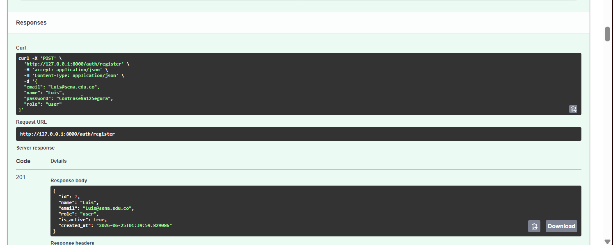

**Resultado esperado:** `201 Created`, con el usuario creado sin exponer `hashed_password`.

---

## 2. Registro con contraseña débil

Intento de registro con una contraseña que no cumple las reglas mínimas (por ejemplo, sin mayúscula). El `field_validator` del schema `UserRegister` rechaza la petición antes de que llegue a la base de datos.

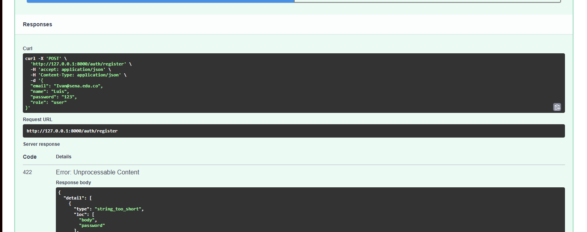

**Resultado esperado:** `422 Unprocessable Entity`, con el detalle de la regla incumplida (mayúscula, minúscula, número o espacios).

---

## 3. Registro con email duplicado

Intento de registrar un segundo usuario con un correo que ya existe en la base de datos.

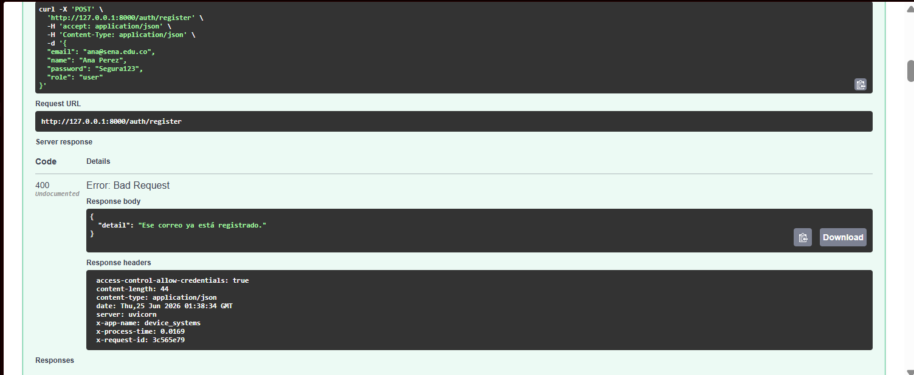

**Resultado esperado:** `400 Bad Request`, con el mensaje `"Ese correo ya está registrado."`

---

## 4. Login correcto

Autenticación exitosa mediante `POST /auth/login` con credenciales válidas. La API verifica la contraseña contra el hash almacenado y genera un token JWT firmado.

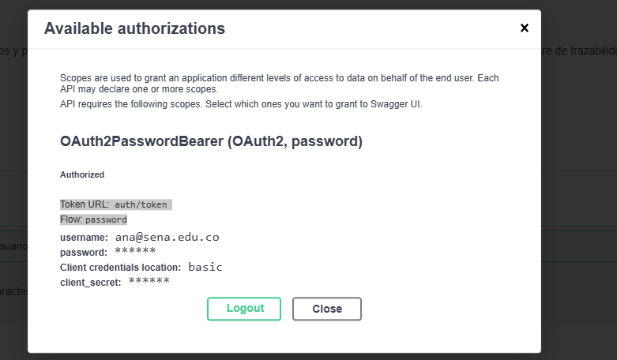

**Resultado esperado:** `200 OK`, con `access_token` y `token_type: "bearer"`.

---

## 5. Login con contraseña incorrecta

Intento de login con la contraseña equivocada para un correo existente.

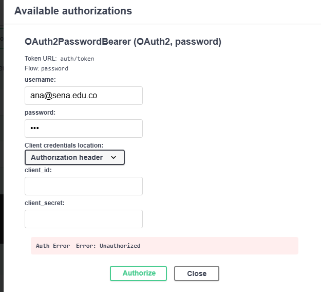

**Resultado esperado:** `401 Unauthorized`, con el mensaje `"Correo o contraseña incorrectos."`

---

## 6. Consulta de /auth/me

Consulta del perfil del usuario autenticado usando el token Bearer obtenido en el login.

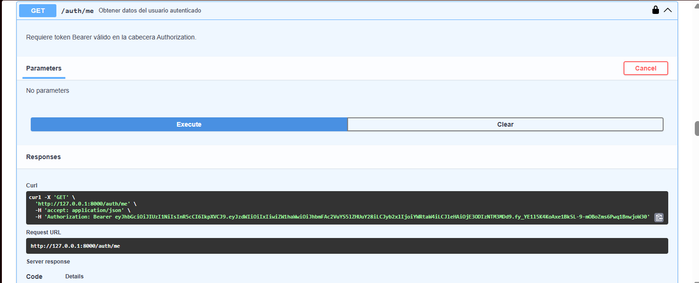

**Resultado esperado:** `200 OK`, con los datos del usuario (`id`, `name`, `email`, `role`, `is_active`, `created_at`), sin incluir `hashed_password` en ningún momento.

---

## 7. Acceso a ruta protegida sin token

Intento de consultar `GET /users` sin enviar ninguna cabecera de autorización.

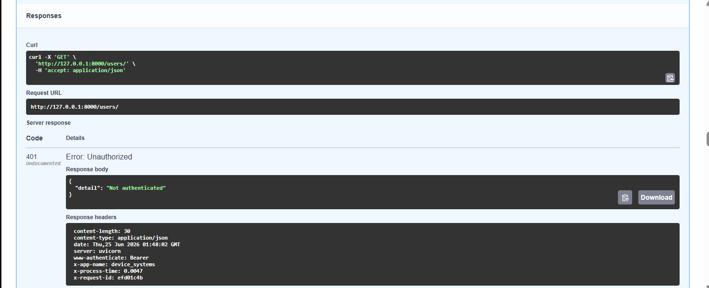

**Resultado esperado:** `401 Unauthorized`.

---

## 8. Acceso con token inválido

Intento de consultar una ruta protegida enviando un token JWT mal formado o alterado.

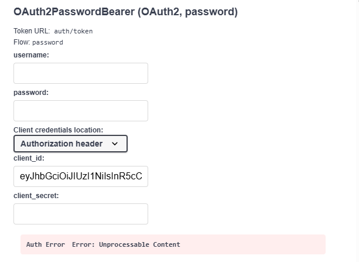

**Resultado esperado:** `401 Unauthorized`, con el mensaje `"No se pudo validar las credenciales."`

---

## 9. Acceso con usuario sin permisos

Un usuario autenticado con rol `user` intenta ejecutar una operación reservada para `admin` (por ejemplo, `DELETE /devices/{device_id}`).

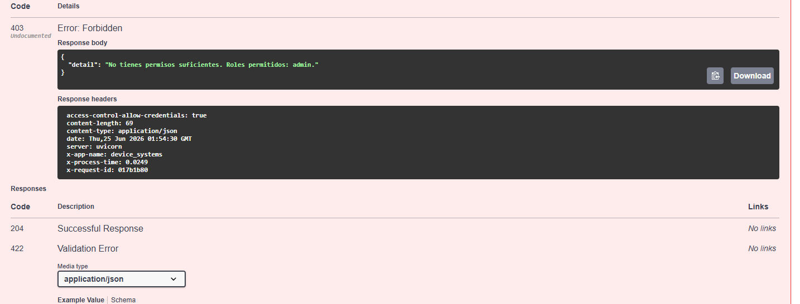

**Resultado esperado:** `403 Forbidden`, indicando los roles permitidos para esa operación.

---

## 10. Creación de dispositivo con rol permitido

Un usuario con rol `admin` (o `support`) crea un nuevo dispositivo mediante `POST /devices`.

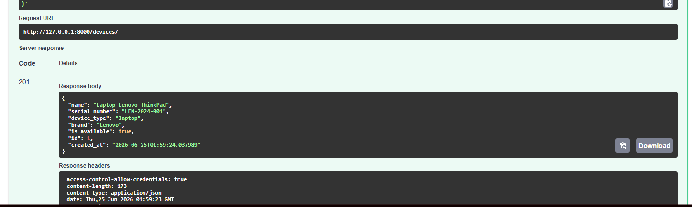

**Resultado esperado:** `201 Created`, con el dispositivo registrado.

---

## 11. Eliminación de dispositivo con rol no permitido

Un usuario con rol `user` intenta eliminar el dispositivo creado en el paso anterior.


**Resultado esperado:** `403 Forbidden`.

---

## 12. Configuración CORS

Verificación de la configuración de CORS, mostrando los orígenes permitidos (`http://localhost:5173` y `http://localhost:3000`) configurados en `CORSMiddleware`, junto con `allow_credentials=True`, `allow_methods=["*"]` y `allow_headers=["*"]`.

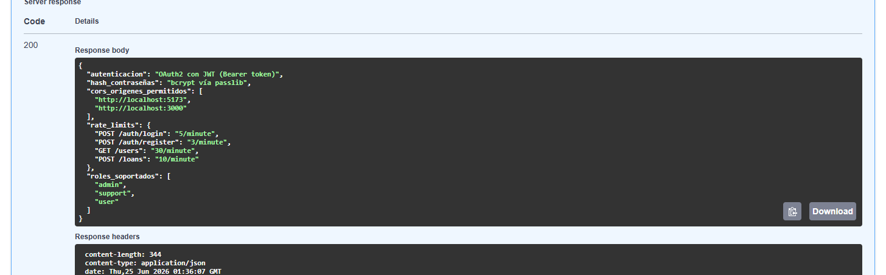

**Resultado esperado:** Las peticiones desde los orígenes autorizados incluyen las cabeceras `Access-Control-Allow-Origin` y `Access-Control-Allow-Credentials` en la respuesta.

---

## 13. Cabeceras generadas por middleware

Inspección de las cabeceras de respuesta generadas por el middleware personalizado `RequestTracingMiddleware` en cualquier petición.

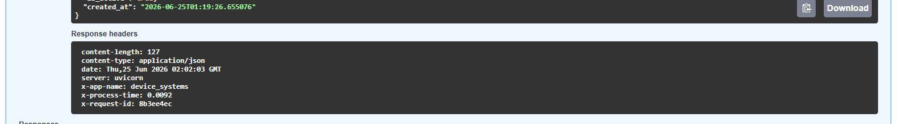

**Resultado esperado:** Presencia de las cabeceras:
```
X-App-Name: device_systems
X-Process-Time: 0.0xxx
X-Request-ID: xxxxxxxx
```

---

## 14. Activación de rate limiting

Envío repetido de peticiones a `POST /auth/login` (más de 5 en un minuto) para forzar el límite configurado con slowapi.

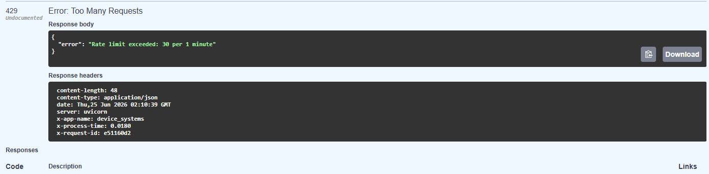

**Resultado esperado:** Las primeras 5 peticiones se procesan normalmente; a partir de la 6.ª, la API responde `429 Too Many Requests`.

---

## 15. Verificación de Swagger/OpenAPI

Vista general de la documentación interactiva en `/docs`, mostrando los endpoints organizados por los tags `Auth`, `Users`, `Devices`, `Loans` y `Security`, con el esquema de seguridad OAuth2 visible y el botón "Authorize" funcional.

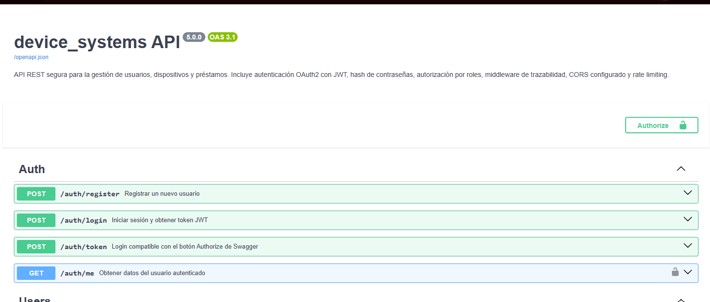

**Resultado esperado:** Todos los endpoints protegidos muestran el ícono de candado, y el esquema `OAuth2PasswordBearer` aparece correctamente definido en la especificación OpenAPI.

---

## Resumen de mecanismos de seguridad implementados

| Mecanismo | Herramienta | Ubicación en el código |
|---|---|---|
| Hash de contraseñas | passlib (bcrypt) | `app/auth/security.py` |
| Autenticación | OAuth2 + JWT (python-jose) | `app/auth/auth_routes.py`, `app/auth/security.py` |
| Autorización por rol | Dependencias de FastAPI | `app/dependencies/auth_dependency.py` |
| Validación avanzada | Pydantic v2 (`field_validator`, `ConfigDict`) | `app/schemas/auth_schema.py` |
| CORS | `CORSMiddleware` | `app/main.py` |
| Trazabilidad | Middleware personalizado | `app/middlewares/request_middleware.py` |
| Rate limiting | slowapi | `app/middlewares/rate_limiter.py`, rutas decoradas |
| Migraciones | Alembic | `alembic/versions/` |

### ¿Por qué no se debe usar `allow_origins=["*"]` junto con `allow_credentials=True`?

Cuando una API permite credenciales (cookies, cabeceras de autorización con tokens) en peticiones cross-origin, el origen debe estar explícitamente autorizado. Si se usara `"*"` como origen permitido junto con `allow_credentials=True`, cualquier sitio web —incluso uno malicioso— podría enviar peticiones autenticadas en nombre del usuario que tenga la pestaña abierta, ya que el navegador adjuntaría las credenciales sin restricción de origen. Por esa razón, los navegadores modernos bloquean directamente esa combinación, y en `device_systems` se usa una lista blanca explícita (`CORS_ORIGINS` en `.env`) con los dominios reales del frontend autorizado.

---

## Reflexión

Esta fase transformó `device_systems` de una API funcional a una API **seguible y consumible por un frontend real**. Implementar OAuth2 con JWT obligó a pensar en el ciclo de vida completo de una sesión: cómo se emite un token, qué información lleva, cuánto dura, y cómo se valida en cada petición sin necesidad de mantener estado en el servidor.

El hash de contraseñas con bcrypt reforzó la idea de que ninguna credencial sensible debe ser reversible ni visible, ni siquiera para quien administra la base de datos. La autorización por roles, implementada como dependencias reutilizables de FastAPI, permitió aplicar reglas de negocio de forma declarativa directamente en la firma de cada endpoint, sin duplicar lógica de validación.

El middleware personalizado y el rate limiting, aunque no afectan la lógica de negocio, son los mecanismos que en la práctica protegen una API expuesta en producción: trazabilidad para depurar incidentes, y límites de peticiones para prevenir abuso o ataques de fuerza bruta sobre el login.
=======
# device_systems — API REST de Gestión de Usuarios v3.0

API REST construida con **FastAPI** para la gestión del recurso `users` dentro del sistema `device_systems`. En esta versión los datos se persisten en una base de datos **SQLite** usando **SQLAlchemy ORM**, reemplazando el almacenamiento en memoria de la versión anterior.

---

## Tecnologías utilizadas

- **Python 3.13**
- **FastAPI 0.110+** — Framework web moderno y de alto rendimiento
- **Uvicorn** — Servidor ASGI para correr la aplicación
- **SQLAlchemy 2.0+** — ORM para la gestión de la base de datos
- **SQLite** — Base de datos relacional ligera (archivo local)
- **Pydantic v2** — Validación y serialización de datos
- **email-validator** — Validación de formato de correos electrónicos

---

## Estructura del proyecto

```
device_systems/
│── app/
│   │── main.py
│   │
│   │── database/
│   │   └── connection.py
│   │
│   │── models/
│   │   └── user_model.py
│   │
│   │── schemas/
│   │   └── user_schema.py
│   │
│   │── routes/
│   │   └── user_routes.py
│   │
│   │── services/
│   │   └── user_service.py
│   │
│   └── dependencies/
│       └── database_dependency.py
│
│── requirements.txt
└── README.md
```

---

## Instalación y ejecución en Windows

### 1. Clona el repositorio

```bash
git clone https://github.com/luisfelipem0991/device_system.git
cd device_system
git checkout feature/database-integration
```

### 2. Crea y activa el entorno virtual

```bash
python -m venv venv
source venv/Scripts/activate
```

> Sabrás que está activo cuando veas `(venv)` al inicio de la línea.

### 3. Instala las dependencias

```bash
pip install -r requirements.txt
```

### 4. Ejecuta el servidor

```bash
uvicorn app.main:app --reload
```

Al arrancar por primera vez, FastAPI crea automáticamente el archivo `device_systems.db` con la tabla `users`.

La API quedará disponible en: [http://127.0.0.1:8000](http://127.0.0.1:8000)

- Swagger UI: [http://127.0.0.1:8000/docs](http://127.0.0.1:8000/docs)
- ReDoc: [http://127.0.0.1:8000/redoc](http://127.0.0.1:8000/redoc)

---

## Tabla de endpoints

| Método | Endpoint                        | Descripción                          | Status         |
|--------|---------------------------------|--------------------------------------|----------------|
| GET    | `/users`                        | Lista todos los usuarios             | 200 OK         |
| GET    | `/users?role=admin`             | Filtra usuarios por rol              | 200 OK         |
| GET    | `/users?is_active=true`         | Filtra usuarios por estado           | 200 OK         |
| GET    | `/users?order_by=name`          | Ordena por nombre o fecha            | 200 OK         |
| GET    | `/users/{user_id}`              | Obtiene un usuario por ID            | 200 OK         |
| POST   | `/users`                        | Registra un nuevo usuario            | 201 Created    |
| PUT    | `/users/{user_id}`              | Actualización completa               | 200 OK         |
| PATCH  | `/users/{user_id}`              | Actualización parcial                | 200 OK         |
| DELETE | `/users/{user_id}`              | Elimina un usuario                   | 204 No Content |

---

## Códigos de estado HTTP

| Código | Nombre               | Cuándo se usa                                     |
|--------|----------------------|---------------------------------------------------|
| 200    | OK                   | GET, PUT y PATCH exitosos                         |
| 201    | Created              | POST exitoso, usuario creado                      |
| 204    | No Content           | DELETE exitoso, sin cuerpo de respuesta           |
| 400    | Bad Request          | Correo duplicado, rol inválido o PATCH sin datos  |
| 404    | Not Found            | Usuario no encontrado por ID                      |
| 422    | Unprocessable Entity | Datos inválidos detectados por Pydantic           |

---

## Ejemplos de peticiones y respuestas

### POST `/users` — Crear usuario

**Body:**
```json
{
  "name": "Luis Felipe Molina",
  "email": "luis@mail.com",
  "role": "admin",
  "is_active": true
}
```

**Response `201 Created`:**
```json
{
  "id": 1,
  "name": "Luis Felipe Molina",
  "email": "luis@mail.com",
  "role": "admin",
  "is_active": true,
  "created_at": "2025-06-01T10:30:00"
}
```

---

### GET `/users` — Listar con filtros

```
GET /users?role=admin&is_active=true&order_by=name
```

**Response `200 OK`:**
```json
[
  {
    "id": 1,
    "name": "Luis Felipe Molina",
    "email": "luis@mail.com",
    "role": "admin",
    "is_active": true,
    "created_at": "2025-06-01T10:30:00"
  }
]
```

---

### PUT `/users/{user_id}` — Actualización completa

**Body:** todos los campos son obligatorios.
```json
{
  "name": "Luis Felipe Actualizado",
  "email": "luis_nuevo@mail.com",
  "role": "support",
  "is_active": false
}
```

---

### PATCH `/users/{user_id}` — Actualización parcial

**Body:** solo los campos a modificar.
```json
{
  "role": "support"
}
```

---

### DELETE `/users/{user_id}`

**Response `204 No Content`** — Sin cuerpo de respuesta.

---

## Manejo de errores

| Escenario                      | Código | Mensaje                                              |
|--------------------------------|--------|------------------------------------------------------|
| Usuario no encontrado          | 404    | `"El usuario que buscas no existe."`                 |
| Correo duplicado               | 400    | `"Ese correo ya existe, intenta con otro."`          |
| Rol no permitido               | 400    | `"Rol '...' no permitido. Usa: admin, support, user."` |
| PATCH sin campos               | 400    | `"Debes enviar al menos un campo para actualizar."`  |
| Datos inválidos (Pydantic)     | 422    | Detalle automático de FastAPI                        |

Todos los errores retornan:
```json
{
  "detail": "Mensaje descriptivo del error"
}
```

---

## Base de datos

### Modelo `users`

| Campo        | Tipo     | Restricción                  |
|--------------|----------|------------------------------|
| `id`         | Integer  | Primary Key, autoincremental |
| `name`       | String   | Obligatorio, mín. 3 chars    |
| `email`      | String   | Único y obligatorio          |
| `role`       | String   | admin / support / user       |
| `is_active`  | Boolean  | Default `True`               |
| `created_at` | DateTime | Se asigna automáticamente    |

El archivo `device_systems.db` se genera automáticamente en la raíz del proyecto al iniciar el servidor por primera vez. Está incluido en `.gitignore` para no subirse al repositorio.

---

## Schemas Pydantic

| Schema         | Uso                              |
|----------------|----------------------------------|
| `UserCreate`   | Crear usuario (POST)             |
| `UserUpdate`   | Actualización completa (PUT)     |
| `UserPatch`    | Actualización parcial (PATCH)    |
| `UserResponse` | Respuesta de todos los endpoints |

### Validaciones
- `name`: mínimo 3 caracteres, obligatorio
- `email`: formato válido (usa `EmailStr`)
- `role`: solo permite `admin`, `support`, `user`
- `is_active`: booleano

---

## Cabeceras HTTP personalizadas

Todos los endpoints retornan:

```
X-App-Name: device_systems
X-API-Version: 3.0
```

---

## Reflexión

Migrar de listas en memoria a una base de datos real con **SQLAlchemy** fue un cambio importante en la arquitectura del proyecto. Lo más valioso fue entender cómo funciona el **ORM**: en lugar de manipular diccionarios, ahora trabajamos con objetos Python que representan filas en una tabla real, y SQLAlchemy se encarga de traducir esas operaciones a SQL.

La inyección de la sesión de base de datos con `Depends(get_db)` mantiene el código limpio y desacoplado: cada endpoint recibe su sesión, la usa y la cierra automáticamente gracias al generador `yield`. Esto evita fugas de conexión y hace el código más seguro.

La adición del campo `created_at` con `default=datetime.utcnow` también fue un buen ejemplo de cómo el modelo ORM puede manejar lógica de negocio básica sin intervención del desarrollador en cada petición.
se añadio link del video https://www.loom.com/share/581dde6e282f45e2bffb2cca87baf328
 main
