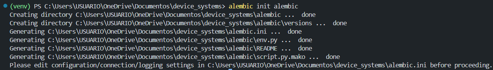
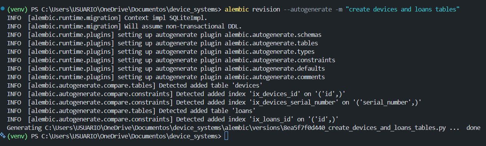
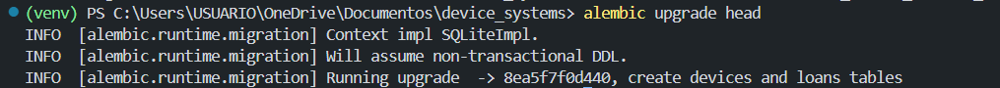
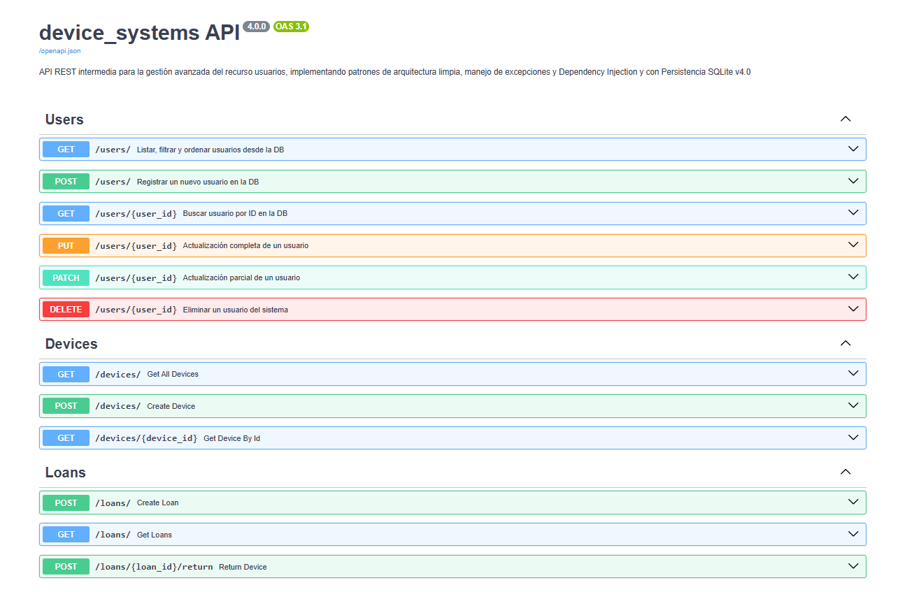
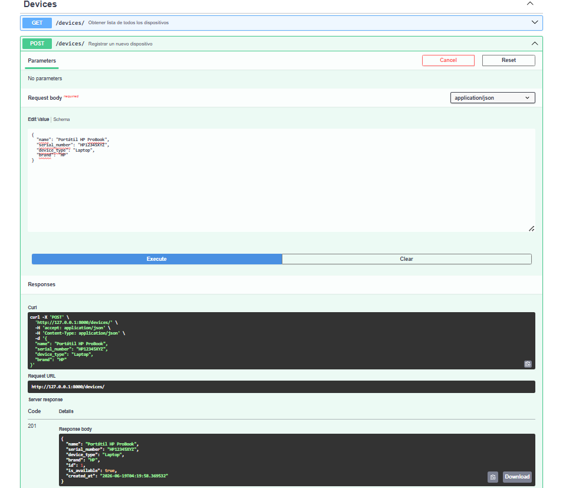
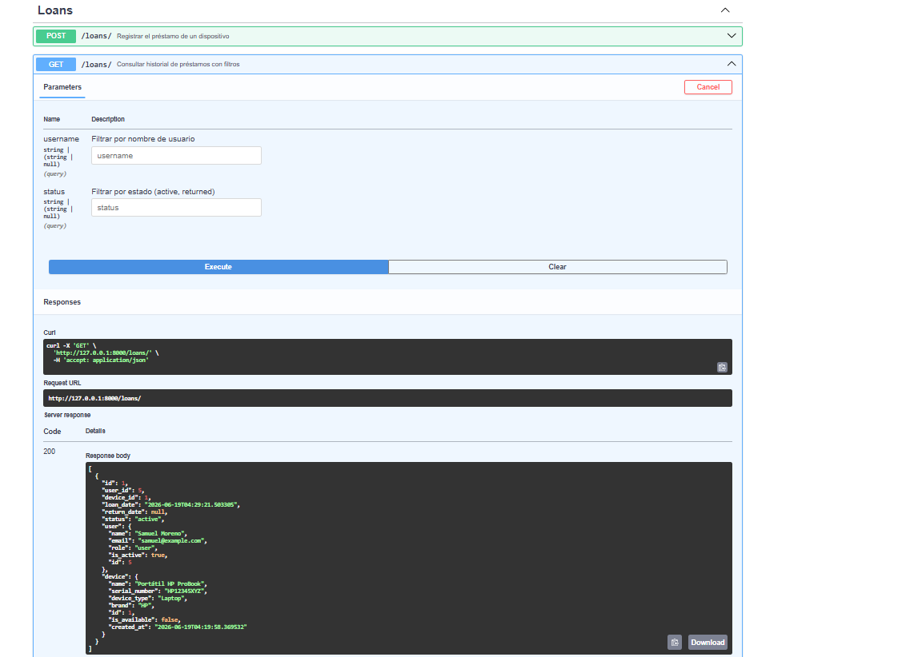

# device_systems — Evidencias v4.0
### Migraciones con Alembic, Relaciones entre Modelos y Consultas Avanzadas

Este documento contiene la evidencia de la implementación de Alembic, las relaciones entre `User`, `Device` y `Loan`, y las consultas con joins y filtros sobre la API **device_systems**.

---

## 1. Inicialización de Alembic

```bash
alembic init alembic
```

Este comando crea la estructura base de Alembic: la carpeta `alembic/versions/` (donde se guardan las migraciones), el archivo `env.py` (que conecta Alembic con los modelos de SQLAlchemy) y `alembic.ini` (configuración general, incluida la URL de la base de datos).



---

## 2. Creación de migración con autogenerate

```bash
alembic revision --autogenerate -m "create devices and loans tables"
```

Alembic compara los modelos definidos en `app/models/` contra el estado actual de la base de datos y genera automáticamente el script de migración con las tablas e índices nuevos detectados.



---

## 3. Aplicación de la migración

```bash
alembic upgrade head
```

Este comando ejecuta el script de migración generado y lleva la base de datos hasta la última versión (`head`).



---

## 4. Estructura de tablas generadas

Verificación de las tablas creadas en `device_systems.db` y de las columnas del modelo `loans`, donde se observan las llaves foráneas `user_id` y `device_id`.


---

## 5. Swagger UI — Vista general

Documentación automática de FastAPI organizada en tres tags: `Users`, `Devices` y `Loans`.



---

## 6. Swagger UI — Endpoints de Loans

Detalle de los endpoints `POST /loans/`, `GET /loans/details` y `PATCH /loans/{loan_id}/return`.


---

## 7. Evidencia de creación de usuario, dispositivo y préstamo

Creación exitosa de un usuario (`POST /users/`), un dispositivo (`POST /devices/`) y un préstamo que los relaciona (`POST /loans/`), todos con respuesta `201 Created`.



---

## 8. Evidencia de consultas con joins

Resultado de `GET /loans/details`, que combina información de las tablas `loans`, `users` y `devices` mediante `join()`, mostrando los datos del usuario y del dispositivo anidados dentro de cada préstamo.


---

## 9. Evidencia de filtros aplicados

Resultados de los filtros avanzados:
- `GET /loans/?status=active`
- `GET /loans/details?device_type=laptop`
- `GET /users/1/loans`



---

## 10. Evidencia de devolución de dispositivo

Ejecución de `PATCH /loans/1/return`, que marca el préstamo como `returned`, asigna `return_date` y libera el dispositivo (`is_available: true`).


---

## 11. Verificación final del dispositivo disponible

Confirmación con `GET /devices/1` de que el dispositivo volvió a estar disponible tras la devolución.


---

## Reflexión

Implementar Alembic, las relaciones entre modelos y las consultas con joins cambió por completo la forma en que entiendo una API REST conectada a una base de datos real.

**Sobre las migraciones:** antes, cualquier cambio en un modelo significaba borrar la base de datos y empezar de cero. Con Alembic, cada cambio estructural queda registrado como una migración versionada, lo que permite aplicar cambios de forma controlada, revertirlos si algo falla, y mantener sincronizada la base de datos entre distintos entornos o compañeros de equipo sin perder información.

**Sobre las relaciones:** entender `ForeignKey()` y `relationship()` me hizo ver que un modelo de datos relacional no es solo un conjunto de tablas aisladas, sino una red de dependencias con sentido de negocio real. Un préstamo no existe sin un usuario y sin un dispositivo; esa regla ahora vive en la propia estructura de la base de datos, no solo en el código de la API.

**Sobre las consultas avanzadas:** los joins me permitieron dejar de pensar en "una tabla a la vez" y empezar a construir respuestas que combinan información de varias fuentes en una sola consulta eficiente, en lugar de hacer múltiples llamadas separadas y unir los datos manualmente en Python.

En conjunto, esta actividad me mostró cómo se construye un backend más cercano a un sistema real de producción: con historial de cambios, integridad referencial y consultas que reflejan relaciones reales entre los datos.