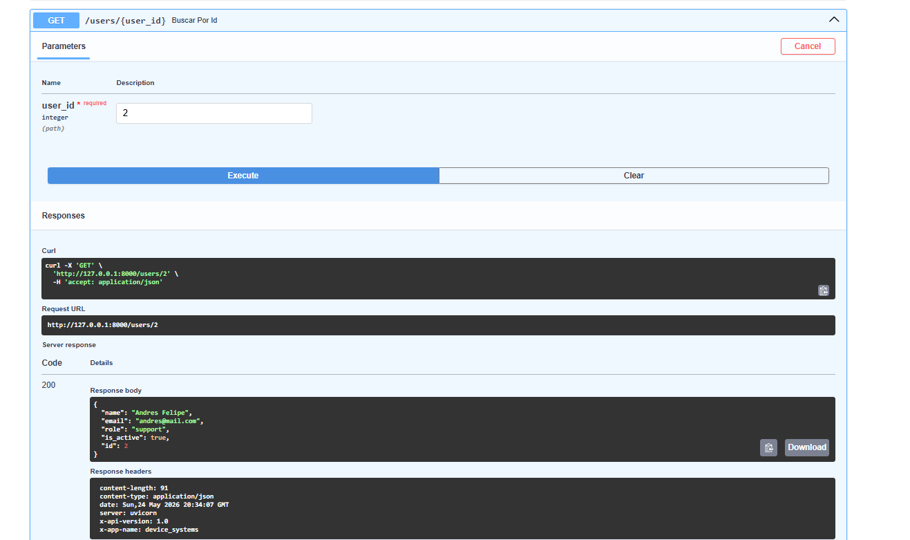
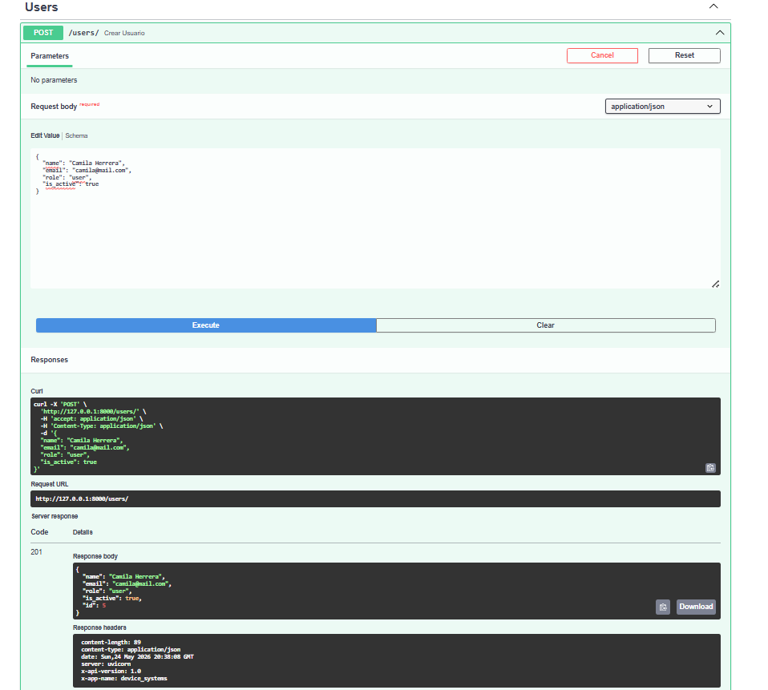
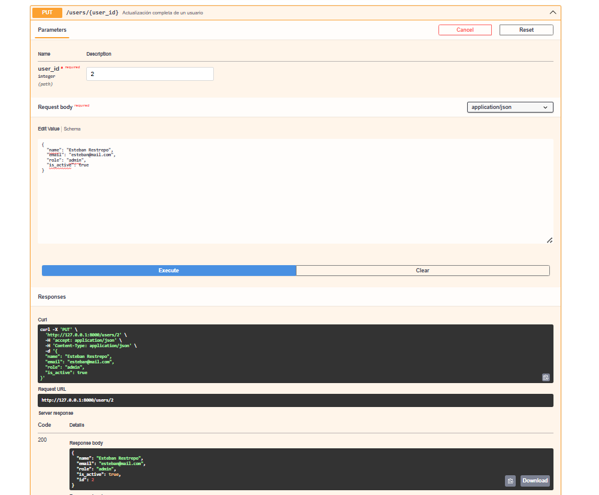
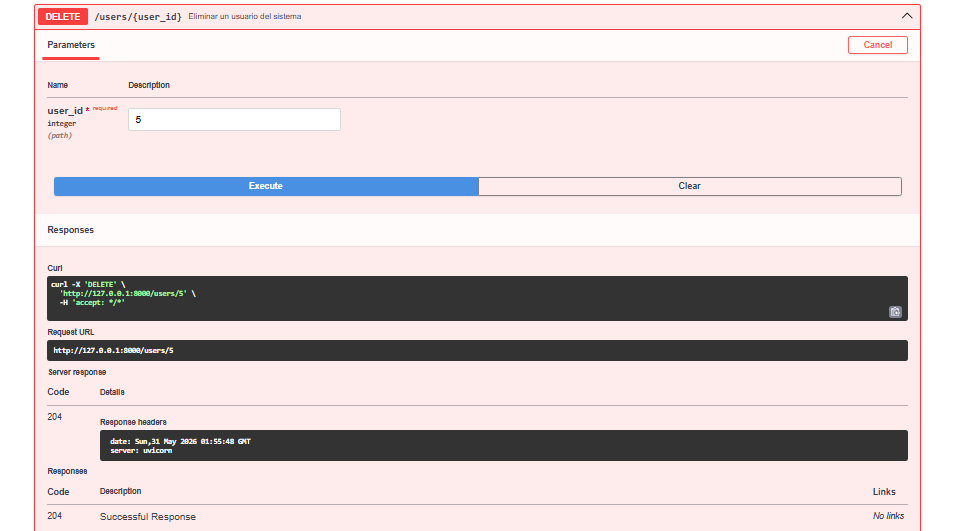
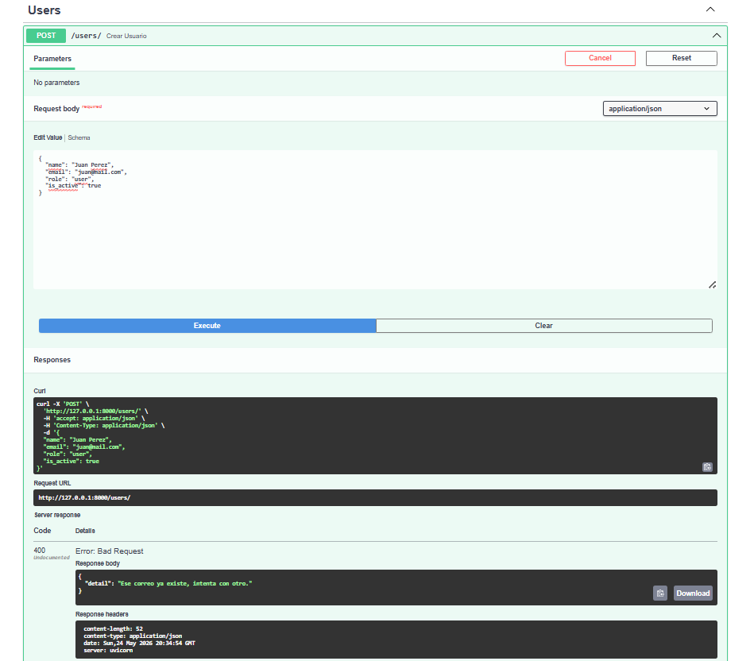

#  device_systems — API REST de Gestión de Usuarios v2.0

API REST construida con **FastAPI** para la gestión del recurso `users` dentro del sistema `device_systems`. Implementa arquitectura limpia con separación en capas, CRUD completo, validación con Pydantic v2, Dependency Injection, manejo profesional de errores y documentación automática con Swagger/OpenAPI.

---

## Tecnologías utilizadas

- **Python 3.x**
- **FastAPI 0.110+** — Framework web moderno y de alto rendimiento
- **Uvicorn 0.28+** — Servidor ASGI para correr la aplicación
- **Pydantic v2** — Validación y serialización de datos
- **email-validator** — Validación de formato de correos electrónicos

---

## Estructura del proyecto

```
device_systems/
│── app/
│   │── main.py
│   │── data/
│   │   └── users_db.py
│   │── dependencies/
│   │   └── user_dependencies.py
│   │── schemas/
│   │   └── user_schema.py
│   │── routes/
│   │   └── user_routes.py
│   └── services/
│       └── user_service.py
│── requirements.txt
└── README.md
```

---

## Instalación de dependencias

Clona el repositorio e instala las dependencias:

```bash
git clone https://github.com/tu-usuario/device_systems.git
cd device_systems
pip install -r requirements.txt
```

Contenido del `requirements.txt`:

```
fastapi>=0.110.0
uvicorn>=0.28.0
pydantic[email]>=2.6.0
```

---

## Ejecución del servidor

```bash
uvicorn app.main:app --reload
```

La API quedará disponible en: [http://127.0.0.1:8000](http://127.0.0.1:8000)

Documentación interactiva Swagger UI: [http://127.0.0.1:8000/docs](http://127.0.0.1:8000/docs)

Documentación alternativa ReDoc: [http://127.0.0.1:8000/redoc](http://127.0.0.1:8000/redoc)

---

## Tabla de endpoints

| Método   | Endpoint                | Descripción                              | Status         |
|----------|-------------------------|------------------------------------------|----------------|
| GET      | `/users`                | Lista todos los usuarios                 | 200 OK         |
| GET      | `/users/{user_id}`      | Obtiene un usuario por su ID             | 200 OK         |
| GET      | `/users?role=admin`     | Filtra usuarios por rol                  | 200 OK         |
| GET      | `/users?is_active=true` | Filtra usuarios por estado activo        | 200 OK         |
| POST     | `/users`                | Registra un nuevo usuario                | 201 Created    |
| PUT      | `/users/{user_id}`      | Actualización completa de un usuario     | 200 OK         |
| PATCH    | `/users/{user_id}`      | Actualización parcial de un usuario      | 200 OK         |
| DELETE   | `/users/{user_id}`      | Elimina un usuario del sistema           | 204 No Content |

---

## Códigos de estado HTTP utilizados

| Código | Nombre                  | Cuándo se usa                                        |
|--------|-------------------------|------------------------------------------------------|
| 200    | OK                      | GET, PUT y PATCH exitosos                            |
| 201    | Created                 | POST exitoso, usuario creado                         |
| 204    | No Content              | DELETE exitoso, sin cuerpo de respuesta              |
| 400    | Bad Request             | Correo duplicado o PATCH enviado sin datos           |
| 404    | Not Found               | Usuario no encontrado por ID                         |
| 422    | Unprocessable Entity    | Datos inválidos detectados por Pydantic              |

---

## 🔍 Ejemplos de peticiones y respuestas

### GET `/users` — Listar todos los usuarios

```
GET http://127.0.0.1:8000/users
```

**Response `200 OK`:**
```json
[
  {
    "id": 1,
    "name": "Luis Felipe Molina",
    "email": "luis@mail.com",
    "role": "admin",
    "is_active": true
  }
]
```

---

### GET `/users/{user_id}` — Consultar usuario por ID

```
GET http://127.0.0.1:8000/users/1
```

**Response `200 OK`:**
```json
{
  "id": 1,
  "name": "Luis Felipe Molina",
  "email": "luis@mail.com",
  "role": "admin",
  "is_active": true
}
```

---

### POST `/users` — Registrar nuevo usuario

```
POST http://127.0.0.1:8000/users
Content-Type: application/json
```

**Body:**
```json
{
  "name": "Laura Gomez",
  "email": "laura@mail.com",
  "role": "support",
  "is_active": true
}
```

**Response `201 Created`:**
```json
{
  "id": 6,
  "name": "Laura Gomez",
  "email": "laura@mail.com",
  "role": "support",
  "is_active": true
}
```

---

### PUT `/users/{user_id}` — Actualización completa

```
PUT http://127.0.0.1:8000/users/1
Content-Type: application/json
```

**Body:**
```json
{
  "name": "Luis Felipe Molina Actualizado",
  "email": "luis_nuevo@mail.com",
  "role": "support",
  "is_active": false
}
```

**Response `200 OK`:**
```json
{
  "id": 1,
  "name": "Luis Felipe Molina Actualizado",
  "email": "luis_nuevo@mail.com",
  "role": "support",
  "is_active": false
}
```

---

### PATCH `/users/{user_id}` — Actualización parcial

```
PATCH http://127.0.0.1:8000/users/1
Content-Type: application/json
```

**Body (solo los campos a cambiar):**
```json
{
  "role": "support"
}
```

**Response `200 OK`:**
```json
{
  "id": 1,
  "name": "Luis Felipe Molina",
  "email": "luis@mail.com",
  "role": "support",
  "is_active": true
}
```

---

### DELETE `/users/{user_id}` — Eliminar usuario

```
DELETE http://127.0.0.1:8000/users/1
```

**Response `204 No Content`** — Sin cuerpo de respuesta.

---

## Dependency Injection con `Depends()`

El proyecto utiliza `Depends()` de FastAPI para **reutilizar lógica común** entre múltiples endpoints sin repetir código. Las dependencias están definidas en `app/dependencies/user_dependencies.py`.

### `get_user_or_404`
Busca un usuario por su ID en la base de datos. Si no existe, lanza automáticamente un error `404 Not Found` antes de que el endpoint se ejecute. Se usa en GET por ID, PUT, PATCH y DELETE.

```python
def get_user_or_404(user_id: int) -> dict:
    for usuario in db_users:
        if usuario["id"] == user_id:
            return usuario
    raise HTTPException(status_code=404, detail="El usuario que buscas no existe.")
```

Uso en una ruta:
```python
@router.get("/{user_id}", response_model=UserResponse)
def buscar_por_id(usuario: dict = Depends(get_user_or_404)):
    return usuario
```

### `verificar_correo_duplicado`
Recorre la base de datos y valida que el correo enviado no esté registrado por otro usuario. Acepta un parámetro `excluir_id` para que al editar un usuario no se estalle contra su propio correo actual.

```python
def verificar_correo_duplicado(email: str, excluir_id: int = None):
    for usuario in db_users:
        if usuario["email"] == email and usuario["id"] != excluir_id:
            raise HTTPException(status_code=400, detail="Ese correo ya existe, intenta con otro.")
```

---

## El Manejo de errores implementado

La API maneja los siguientes escenarios de error usando `HTTPException`:

| Escenario                        | Código | Mensaje de respuesta                                    |
|----------------------------------|--------|---------------------------------------------------------|
| Usuario no encontrado            | 404    | `"El usuario que buscas no existe."`                    |
| Correo electrónico duplicado     | 400    | `"Ese correo ya existe, intenta con otro."`             |
| PATCH enviado sin ningún campo   | 400    | `"Intento de actualización sin datos..."`               |
| Datos inválidos (Pydantic)       | 422    | Detalle automático de FastAPI con el campo inválido     |

Todos los errores retornan una respuesta JSON con la siguiente estructura:

```json
{
  "detail": "Mensaje descriptivo del error"
}
```

---

## Capturas de Swagger UI
 
### 1. GET `/users` — Listar todos los usuarios
 
> _Evidencia de la ejecución del endpoint GET /users retornando la lista completa de usuarios._
 

 
---
 
### 2. GET `/users/{user_id}` — Consultar por ID
 
> _Evidencia de la consulta de un usuario específico mediante su ID como Path Parameter._
 

 
---
 
### 3. POST `/users` — Registrar nuevo usuario
 
> _Evidencia del registro exitoso de un nuevo usuario con validación Pydantic y respuesta 201 Created._
 

 
---
 
### 4. PUT `/users/{user_id}` — Actualización completa
 
> _Evidencia de la actualización completa de un usuario, reemplazando todos sus campos con respuesta 200 OK._
 

 
---
 
### 5. PATCH `/users/{user_id}` — Actualización parcial
 
> _Evidencia de la actualización parcial enviando solo los campos a modificar, con respuesta 200 OK._
 

 
---
 
### 6. DELETE `/users/{user_id}` — Eliminar usuario
 
> _Evidencia de la eliminación exitosa de un usuario con respuesta 204 No Content._
 

 
---
 
### 7. Error — Correo duplicado
 
> _Evidencia del manejo de error al intentar registrar o actualizar un usuario con un correo ya existente, retornando 400 Bad Request._
 

 
---

## 💡 Reflexión sobre el uso de FastAPI para construir APIs REST

Trabajar con **FastAPI** en este taller fue una excelente experiencia. Lo que más me gustó fue lo rápido que se puede levantar un servidor funcional sin configuraciones complejas, además de la **documentación automática con Swagger UI** (`/docs`), que nos ahorró mucho tiempo al darnos una interfaz lista para probar los endpoints y sacar las evidencias.

La combinación con **Pydantic v2** es clave para controlar los datos; basta con definir el molde con las reglas (como el correo válido o el largo del nombre) y el framework frena los datos malos automáticamente, devolviendo errores claros.

Además, la arquitectura del proyecto evolucionó hacia un patrón más limpio separando responsabilidades: las **rutas** solo reciben y responden, los **servicios** contienen la lógica del negocio, y las **dependencias** manejan validaciones reutilizables como `get_user_or_404` y `verificar_correo_duplicado`. Esto hace el código mucho más organizado y fácil de mantener.

Finalmente, el proyecto me ayudó a entender la diferencia práctica entre **Path Parameters** (para buscar un recurso único como el ID), **Query Parameters** (ideales para filtrar listas), y los diferentes métodos HTTP: `POST` para crear, `PUT` para reemplazar completamente, `PATCH` para actualizar solo los campos enviados, y `DELETE` para eliminar retornando `204 No Content`.

---

## 🛡️ Cabeceras HTTP personalizadas

Todos los endpoints retornan las siguientes cabeceras personalizadas:

```
X-App-Name: device_systems
X-API-Version: 2.0
```

### Sustentación en Video sobre la Actividad 7

*   **Enlace al video (Loom):** https://www.loom.com/share/2df8e7ade9914b34b2a81e7d77212f56